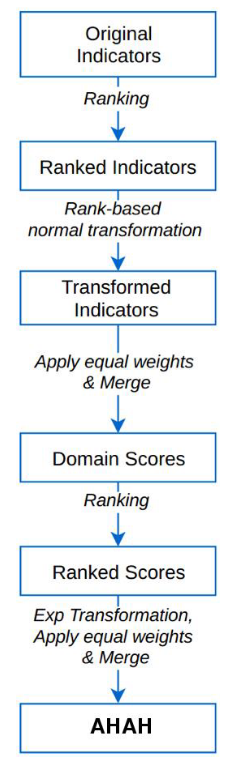

<div align="center">

# Access to Healthy Assets & Hazards (AHAH)

**GPU accelerated road network routing between postcodes and health related POIs**

<a href="https://www.python.org"></a>
<a href="https://rapids.ai/"></a>  
<a href="https://dvc.org/"></a>
<a href="https://black.readthedocs.io/en/stable/"></a>

</div>

<p align="center">
<a href="https://cjber.github.io/ahah/ahah">Documentation</a> •
<a href="todo">FigShare (soon)</a>
</p>

[Cillian
Berragan](https://www.liverpool.ac.uk/geographic-data-science/our-people/)
\[[`@cjberragan`](http://twitter.com/cjberragan)\]<sup>1\*</sup> [Mark
Green](https://www.liverpool.ac.uk/geographic-data-science/our-people/)
\[[`@markalangreen`](http://twitter.com/markalangreen)\]<sup>1</sup>
[Alex
Singleton](https://www.liverpool.ac.uk/geographic-data-science/our-people/)
\[[`@alexsingleton`](http://twitter.com/alexsingleton)\]<sup>1</sup>

<sup>1</sup> _Geographic Data Science Lab, University of Liverpool,
Liverpool, United Kingdom_  
<sup>\*</sup> _Correspondence_: C.Berragan@liverpool.ac.uk

## Overview

This project identifies the time-weighted distance required to travel by road between every postcode in Great Britain and a selection of health related points of interest. A ranked combination of these drive-times is used to create the AHAH index.

Access is defined through the average time-weighted road network distance for each postcode within each LSOA to the nearest point of interest of a particular type. For this, the road highways network and road speed estimates provided through [Ordnance Survey](https://www.ordnancesurvey.co.uk/business-government/products/open-map-roads) was used, alongside the [OWNS Postcode Directory for May 2020](https://data.gov.uk/dataset/06803af0-6054-410a-822a-f7ab30bcd8b1/ons-postcode-directory-may-2020), which gives centroids for every postcode in the country.

This is a computationally intense calculation, with the total road network used having 3,816,897 edges, and 3,215,522 nodes. Access to each nearest health related POI was calculated using the _Single Source Shortest Path_ algorithm, for all 1,659,451 postcodes in Great Britain.

This calculation was made possible through the GPU accelerated Python library `cugraph`, part of the [NVIDIA RAPIDS ecosystem](https://rapids.ai), allowing the computation to be highly parallel, taking minutes, rather than days.

## Project layout

```bash
ahah
├── aggregate_lsoa.py  # aggregate outputs to LSOA level
├── create_index.py  # use aggregates to create index
├── get_nhs.py  # retrieve NHS data
├── os_highways.py  # process OS open roads data
├── process_air.py  # process air quality data
├── process_routing.py  # process all POI data
├── routing.py  # main routing class
└── common
    ├── logger.py  # use rich logging
    └── utils.py  # utility functions
```

## Methodology

Accessibility measures were created using the `cugraph` GPU accelerated Python library for parallel processing of graph networks, in conjunction with the OS Open Road network. Unlike Routino, which uses Open Street Map data, the OS Open Road Network provides more accurate road speed estimates for UK roads.

In this study, we measured the network distance (travel time) between the centroid of each active postcode in Great Britain to the coordinates of each unique health asset (e.g. GP practice). Measured network distances for each indicator for postcodes were aggregated to the LSOA level, providing average network distance for each indicator (as a measure of accessibility). All other indicators were also summarised for LSOAs. The indicators within each domain were standardised by ranking and transformed to the standard normal distribution. The direction of each variable was dictated by the literature (e.g. accessibility to fast food outlets were identified as health negating, wheras accessibility to GP practices was health promoting).

To calculate our overall index (and domain specific values), we followed the methodology of the 2015 IMD. For each domain, we ranked each domain $R$ and any LSOA scaled to the range $[0,1]$. $R=1/N$ for the most 'health promoting' LSOA and $R=N/N$ for the least promoting, where $N$ is the number of LSOAs in Great Britain. Exponential transformation of the ranked domainscores was then applied to LSOA values to reduce ‘cancellation effects’. So, for example, high levels of accessibility in one domainare not completely cancelled out by low levels of accessibility in a different domain. The exponential  transformation  applied also puts  more  emphasis  on  the LSOAs  at  theend  of  the health demoting side of the distribution and so facilitates identification of the neighbourhoods with the worsthealth promoting aspects. The exponential transformed indicator score $X$ is given by:

$$
X=−23ln(1−R(1−exp^{−100/23}))
$$

where ‘ln’ denotes natural logarithm and ‘exp’ the exponential transformation.

The main domains across our  indicators: retail  services,  health  services, physical  environment and  air quality then were combined to form an overall index of‘Access to Healthy Assets and Hazards’ (AHAH)



## Scripts

### 1. Process road network `ahah/os_highways.py`

- Speed estimates given to each road, based on `formOfway` and
  `roadClassification`
- Time-weighted distance calculated using length of edge and speed
  estimate
- Node ID converted to sequential integers and saved with edges as
  parquet files

### 2. Process Data `ahah/process_routing.py`

> This stage prepares the `nodes`, `postcodes`, and `poi` data for use
> in RAPIDS `cugraph`. Makes use of utility functions to assist with
> data preparation from the raw data sources.

- Clean raw data
- Find the nearest road node to each postcode and point of interest
  using GPU accelerated K Means Clustering
- Determine minimum buffer distance to use for each point of interest
  - Distances returned for nearest 10 points of interest to each
    postcode using K Means
  - For each unique POI the maximum distance to associated postcodes is
    taken and saved as a buffer for this POI
  - Each POI is assigned the postcodes that fall within their KNN, used
    to determine buffer suitability when converted to a graph
- All processed data written to respective files

### 3. Routing `ahah/routing.py`

> The routing stage of this project primarily makes use of the RAPIDS
> `cugraph` library. This stage iterates sequentially over each POI of a
> certain type and finds routes to every postcode within a certain
> buffer.

- Iterate over POI of a certain type
- Create `cuspatial.Graph()` with subset of road nodes using
  `cuspatial.points_in_spatial_window` with buffer
- Run _single-source shortest path_ from POI to each node in the sub
  graph
  - `cugraph.sssp` takes into account `weights`, which in this case are
    the `time-weighted` distance of each connection between nodes as
    reported by OSM.
- `SSSP` distances subset to return only nodes associated with
  postcodes, these distances are added iteratively to a complete
  dataframe of postcodes of which the smallest value for each postcode
  is taken

## 4. Combine into index `ahah/create_index.py`

- Combine both processed secure and open data
- Intermediate variables calculated
  - All variables ranked
  - Exponential default calculated for all ranked variables
  - Percentiles calculated from ranked variables
- Domains Scores calculated
  - Domain scores calculated from mean of each domains input variables
  - Domain scores ranked
  - Domain percentiles calculated
  - Exponential transformation calculated for each domain
- AHAH index calculated from mean of domain exponential transformations
  - Ranked AHAH index calculated
  - AHAH percentiles calculated

Exponential default:

$$
(x-0.5)/len(y)
$$

Exponential transformation:

$$
X=-23 ln(1-R(1-exp(-100/23)))
$$

## AHAH Data Sources

> See the [AHAH V2 FigShare
> Repository](https://figshare.com/articles/online_resource/Access_to_Healthy_Assets_and_Hazards_AHAH_-_Updated_version_2017/8295842/1)
> for the previous iteration.

- [OS
  Open Roads](https://www.ordnancesurvey.co.uk/business-government/products/open-map-roads)
- [Ferry Routes](https://www.ordnancesurvey.co.uk/business-government/products/strategi)
- [Air quality](https://uk-air.defra.gov.uk/data/pcm-data)
- Greenspace (NDVI Classification)
- [NHS
  England](https://digital.nhs.uk/services/organisation-data-service/data-downloads)
- [NHS Scotland](https://www.opendata.nhs.scot/dataset/)

- [Postcodes](https://geoportal.statistics.gov.uk/datasets/ons-postcode-directory-february-2022/about)
- [LSOA
  Polygons](https://borders.ukdataservice.ac.uk/easy_download_data.html?data=England_lsoa_2011)
